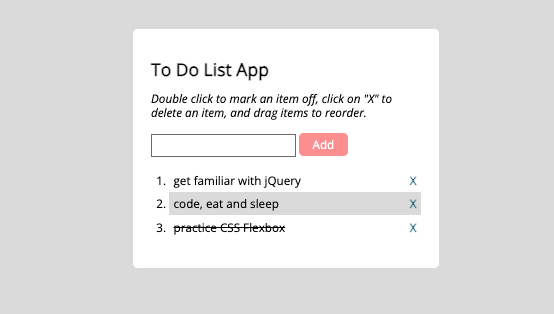

# To-Do List App - A Simple Javascript App

## Project Status

The version 1 of this project has been completed.

## Description

A simple To-Do List app that allows users to manage their tasks. Users can add new items, cross out completed items, delete items, and change the order of items using drag-and-drop functionality.

## Screenshots

## Key Features

- Add new items to the list
- Cross out completed items
- Delete items from the list
- Change the order of items using drag-and-drop
- Interactive buttons and event handling using jQuery
- Basic CSS styling for a clean and simple UI

## Requirements

- Basic knowledge of HTML, CSS, and jQuery
- A modern web browser (Chrome, Firefox, Safari, Edge, Internet Explorer 11)

## API

This app does not use an external API.
